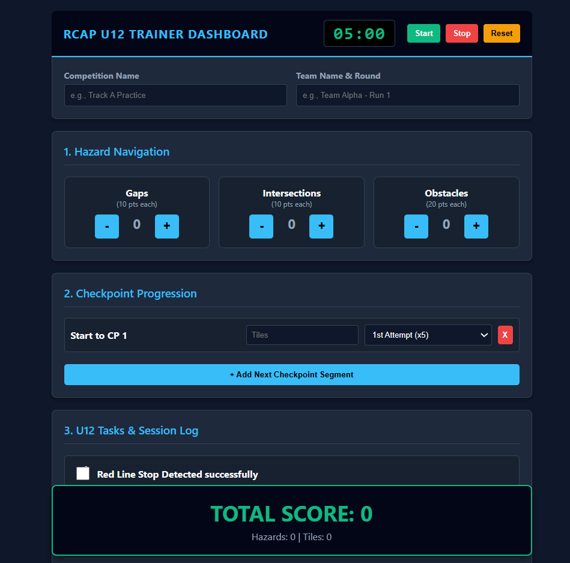

# RCAP Rescue Line Entry, U12 Score Tracker

A lightweight scoring dashboard for **RCAP Rescue Line Entry, U12** training runs. Coaches can log hazards, checkpoint tiles, and missions during live sessions — all saved to a private Google Sheet in real time.



---

# ✨ Features

- **Live Scoring Dashboard** — 5-minute countdown timer with color warnings.
- **Hazard Counters** — Gaps (10 pts), Intersections (10 pts), Obstacles (20 pts).
- **Checkpoint Segments** — Dynamic list with tile counts and attempt multipliers.
- **U12 Mission Task** — Red line stop detection toggle (+25 pts).
- **Cloud Saving** — Runs are saved directly to your own Google Sheet and persist on refresh.
- **No Server Required** — Runs entirely in the browser using HTML/JS and Google Apps Script.

---

# 📋 Scoring Rules (RCAP Rescue Line Entry, U12)

| Element | Points |
|---|---|
| Gap navigated | +10 per gap |
| Intersection navigated | +10 per intersection |
| Obstacle avoided | +20 per obstacle |
| Checkpoint tile (1st attempt) | tiles × 5 |
| Checkpoint tile (2nd attempt) | tiles × 3 |
| Checkpoint tile (3rd attempt) | tiles × 1 |
| Red line detected successfully | +25 |

---

# 🚀 Getting Started

This is a single-file web application. To use the cloud-saving feature, you must link it to your own Google Sheet.

---

## Step 1: Download the Tracker

1. Download the `index.html` file from this repository.
2. Open the file in any web browser to use the tracker locally.
3. To enable permanent cloud saving, continue to Step 2.

---

## Step 2: Set Up Your Google Sheet Database

### 1. Create a New Google Sheet

Open:

https://sheets.new/

---

### 2. Add the Following Headers

In the **first row**, create these headers exactly:

| Timestamp | Team | Hazards | Tiles | RedLine | Total |
|---|---|---|---|---|---|

---

### 3. Open Google Apps Script

Go to:

**Extensions → Apps Script**

Delete any existing code and paste the following script:

```javascript
const SHEET_NAME = 'Sheet1'; // Change this if you rename your sheet tab

// READ DATA (Loads previous runs on refresh)
function doGet(e) {
  const sheet = SpreadsheetApp.getActiveSpreadsheet().getSheetByName(SHEET_NAME);
  const data = sheet.getDataRange().getValues();
  const headers = data[0];
  const rows = data.slice(1);

  const formattedData = rows.map(row => {
    let obj = {};
    headers.forEach((header, i) => {
      obj[header] = row[i];
    });
    return obj;
  });

  return ContentService.createTextOutput(JSON.stringify(formattedData))
    .setMimeType(ContentService.MimeType.JSON);
}

// WRITE OR DELETE DATA
function doPost(e) {
  const sheet = SpreadsheetApp.getActiveSpreadsheet().getSheetByName(SHEET_NAME);

  // Handle "Clear Logs" request
  if (e.parameter.action === 'clear') {
    if (sheet.getLastRow() > 1) {
      sheet.deleteRows(2, sheet.getLastRow() - 1);
    }

    return ContentService.createTextOutput(
      JSON.stringify({ result: 'cleared' })
    ).setMimeType(ContentService.MimeType.JSON);
  }

  // Handle "Save Run" request
  const rowData = [
    new Date().toLocaleString(),
    e.parameter.Team || '',
    e.parameter.Hazards || 0,
    e.parameter.Tiles || 0,
    e.parameter.RedLine || '',
    e.parameter.Total || 0
  ];

  sheet.appendRow(rowData);

  return ContentService.createTextOutput(
    JSON.stringify({ result: 'success' })
  ).setMimeType(ContentService.MimeType.JSON);
}
```

---

### 4. Deploy the Script as a Web App

1. Click **Deploy → New Deployment**
2. Select the **gear icon**
3. Choose **Web App**
4. Under **Execute as**, select:

```text
Me
```

5. Under **Who has access**, select:

```text
Anyone
```

6. Click **Deploy**
7. Authorize permissions if prompted
8. Copy the generated **Web App URL**

---

## Step 3: Connect the Tracker to Your Google Sheet

1. Open `index.html` in a text editor such as:
   - VS Code
   - Notepad++
   - Sublime Text
   - Notepad

2. Find the following configuration variable:

```javascript
const scriptURL = 'YOUR_GOOGLE_APPS_SCRIPT_URL_HERE';
```

3. Replace the placeholder with your copied Google Apps Script URL:

```javascript
const scriptURL = 'https://script.google.com/macros/s/XXXXXXXXXXXXXXXXXXXX/exec';
```

4. Save the file.

5. Double-click `index.html` to open the tracker in your browser.

---

# 🖥️ Usage

1. Start the timer when a run begins.
2. Record hazards as they occur:
   - Gaps
   - Intersections
   - Obstacles
3. Add checkpoint segments and tile counts.
4. Select the correct attempt multiplier.
5. Toggle the Red Line mission if completed successfully.
6. Save the run to store it in Google Sheets.
7. Refresh the page anytime to reload saved runs.

---

# ⚙️ Technologies Used

- HTML5
- CSS3
- JavaScript (Vanilla)
- Google Apps Script
- Google Sheets API

---

# 🔒 Data Storage

All run data is stored privately in your own Google Sheet.

No external server or database is required.

---

# 🛠️ Troubleshooting

## Runs Are Not Saving

Make sure:

- The Apps Script deployment is set to:
  - **Who has access → Anyone**
- You copied the correct `/exec` URL
- The sheet headers match exactly

---

## CORS Error in Browser Console

Usually caused by:

- Incorrect Web App URL
- Deployment permissions not public
- Old deployment version

Try redeploying the script and updating the URL.

---

## Saved Runs Do Not Reload

Ensure:

- The `doGet()` function exists
- Your deployment is updated after code changes
- You refreshed the browser after saving

---

# 🤝 Contributing

Contributions are welcome.

You can improve:

- UI/UX
- Mobile responsiveness
- Additional scoring systems
- Performance
- Accessibility

Fork the repository and submit a pull request.

---

# 📜 License

This project is licensed under the MIT License.

You are free to use, modify, and distribute this software for educational purposes, robotics teams, and competitions.

